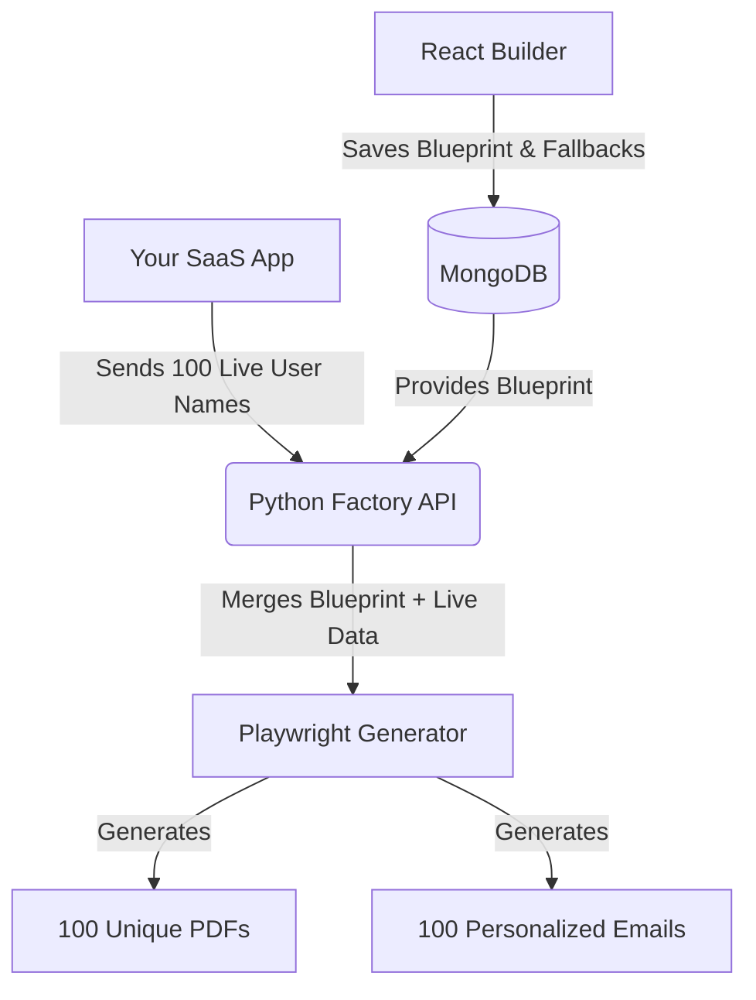

# How Dynamic Variables Work in a SaaS Product

To understand how dynamic variables work, let's use a simple analogy: **The Blueprint** and **The Factory**.

---

### Step 1: The Blueprint (What you are building right now)
Right now, your React frontend is acting as the **Blueprint Designer**. 
When a user drags text onto the canvas and types `Hello ${Name}, welcome to ${Course}!`, they are creating a reusable blueprint.

In the right sidebar, they set **Fallback Values**:
- `Name` = "Student"
- `Course` = "our academy"

When they click **Save**, this exact Blueprint is saved into your **MongoDB Database**. 
*No real certificates are generated yet. It is just saved for later use.*

---

### Step 2: The Factory API (What we will build next)
Imagine your SaaS product has a feature: "Send Certificates to all 50 attendees from today's webinar."

To do this, you will build a new "Factory" endpoint in your Python backend, something like:
`POST /api/generate-bulk-certificates/{template_id}`

Your SaaS frontend (or an automated script) will call this API and send it an **Array of real user data**, like this:

```json
{
  "users": [
    { "Name": "Mitvi Shah", "Course": "Advanced React" },
    { "Name": "John Doe", "Course": "Python Mastery" },
    { "Name": "Sarah", "Course": "UI/UX Design" }
  ]
}
```

---

### Step 3: The Assembly Line (How the Backend processes it)
When your Python API receives this list of users, here is exactly what it does behind the scenes:

1. **Fetch the Blueprint:** It goes to MongoDB and grabs the saved template using the `{template_id}`.
2. **Start a Loop:** It starts a loop to process every single user in that array one by one.

**For User 1 (Mitvi Shah):**
- It looks at the HTML: `Hello ${Name}, welcome to ${Course}!`
- It checks the JSON: Does Mitvi have a Name? Yes. Does she have a Course? Yes.
- It generates PDF #1: `Hello Mitvi Shah, welcome to Advanced React!`

**For User 2 (John Doe):**
- It generates PDF #2: `Hello John Doe, welcome to Python Mastery!`

**For User 4 (A user with missing data):**
- Imagine a user was passed like this: `{ "Course": "Basic HTML" }` (They forgot to provide a name).
- It looks at the HTML: `Hello ${Name}, welcome to ${Course}!`
- It checks the JSON: Is there a Name? **No.**
- *This is where the Fallback saves the day!* It looks at the MongoDB blueprint and sees the fallback for `Name` is "Student".
- It generates PDF #4: `Hello Student, welcome to Basic HTML!`

---

### Summary Visual Workflow



### Conclusion
The Fallback value is simply a **safety net**. It is only ever used if the live dynamic data sent to the "Factory API" is missing or empty. Most of the time, the live data will completely override the Fallback!
